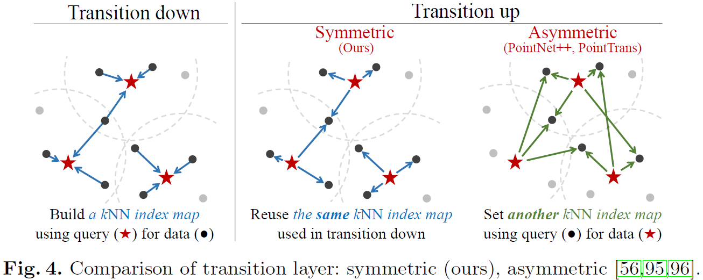
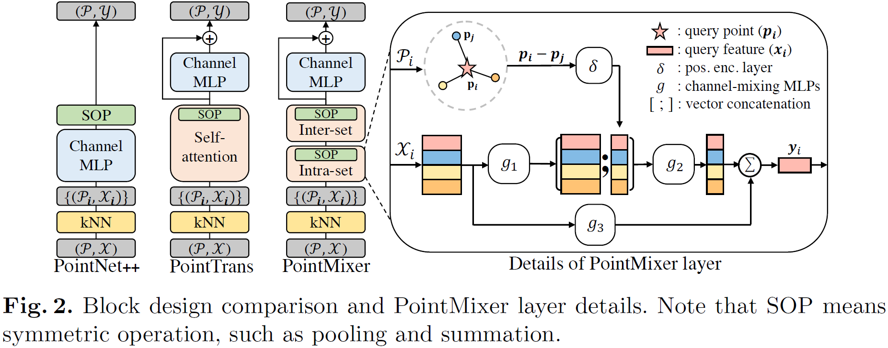

# PointMixer: MLP-Mixer for Point Cloud Understanding

[](https://paperswithcode.com/sota/semantic-segmentation-on-s3dis-area5?p=pointmixer-mlp-mixer-for-point-cloud)

This is an official implementation for the paper,
> [PointMixer: MLP-Mixer for Point Cloud Understanding](https://arxiv.org/pdf/2111.11187)<br/>
> [Jaesung Choe*](https://sites.google.com/view/jaesungchoe), [Chunghyun Park*](https://chrockey.github.io/), [Francois Rameau](https://rameau-fr.github.io/), [Jaesik Park](https://jaesik.info/), and [In So Kweon](https://rcv.kaist.ac.kr)<br/>
> European Conference on Computer Vision (**ECCV**), Tel Aviv, Israel, 2022<br/>
> [[Paper](https://arxiv.org/pdf/2111.11187)]
[[Video](https://youtu.be/96jY3DEjxxo)]
[[VideoSlide](https://www.google.com/url?q=https%3A%2F%2Fwww.dropbox.com%2Fs%2Fzs5xs8cn565gmjw%2FECCV22_Video_Final.pptx%3Fdl%3D0&sa=D&sntz=1&usg=AOvVaw2XScQzRGomnUNiTfE5hi8F)]
[[Poster](https://www.google.com/url?q=https%3A%2F%2Fwww.dropbox.com%2Fs%2Fim5r5jc2kdej2hb%2FECCV22_Poster.pdf%3Fdl%3D0&sa=D&sntz=1&usg=AOvVaw3fxZw3rjDb47-kv-JCjfu9)]
<br/>

(*: equal contribution)

## (TL;DR) Pytorch implementation of `PointMixer`:zap: and `Point Transformer`:zap:

### We are currently updating this repository :fire:
<details>
<summary>Click to expand!</summary>

- [ ] semseg<br/>  
  - [x] ~~methods~~
    - [x] ~~pointmixer~~
    - [x] ~~point transformer~~    
  - [ ] s3dis weights  
  - [ ] scannet weights
  - [ ] logger option (tensorboard / neptune)
- [x] objcls<br/>
- [ ] recon<br/>
</details>

## Features
### 1. Universal point set operator: intra-set, inter-set, and hier-set mixing <br/>
- Newly revisit the use of K-Nearest Neighbors <br/>
- Can process arbitrary number of points <br/>
 <br/>

### 2. Symmetric encoder-decoder network for point clouds <br/>
- Maintain the hierarchical relation among points <br/>
- Design learning-based transition up/down layers (i.e., hier-set mixing) <br/>
 <br/>

### 3. Parameter efficient design (**6.5M**) <br/>
 <br/>


## References
```
@article{choe2021pointmixer,
  title={PointMixer: MLP-Mixer for Point Cloud Understanding},
  author={Choe, Jaesung and Park, Chunghyun and Rameau, Francois and Park, Jaesik and Kweon, In So},
  journal={arXiv preprint arXiv:2111.11187},
  year={2021}
}
```
