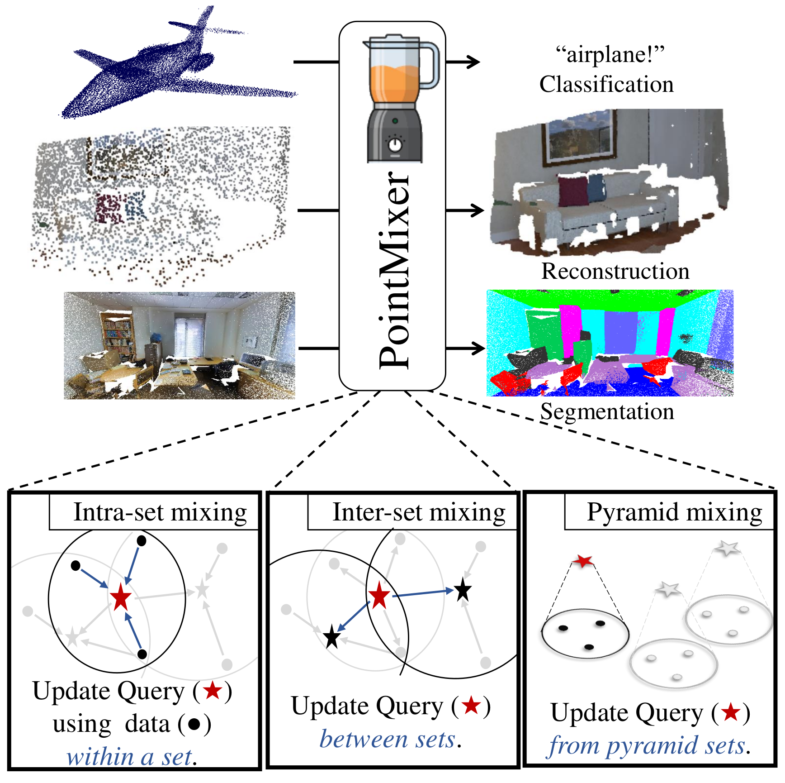

# PointMixer: MLP-Mixer for Point Cloud Understanding

This is an official implementation for the paper,
> [PointMixer: MLP-Mixer for Point Cloud Understanding](https://arxiv.org/pdf/2111.11187)<br/>
> [Jaesung Choe*](https://sites.google.com/view/jaesungchoe), [Chunghyun Park*](https://chrockey.github.io/), [Francois Rameau](https://rameau-fr.github.io/), [Jaesik Park](https://jaesik.info/), and [In So Kweon](https://rcv.kaist.ac.kr)<br/>
> European Conference on Computer Vision (ECCV), Tel Aviv, Israel, 2022<br/>
> [Paper](https://arxiv.org/pdf/2111.11187) [Project] [YouTube] [PPT] [Dataset]<br/>

(*: equal contribution)


## Features
- Universal point set operator: intra-set, inter-set, hier-set
- Symmetric encoder-decoder network for point clouds
- Parameter efficient design (**6.5M**)

 <br/>
 <br/>
 

## References
```
@article{choe2021pointmixer,
  title={PointMixer: MLP-Mixer for Point Cloud Understanding},
  author={Choe, Jaesung and Park, Chunghyun and Rameau, Francois and Park, Jaesik and Kweon, In So},
  journal={arXiv preprint arXiv:2111.11187},
  year={2021}
}
```
