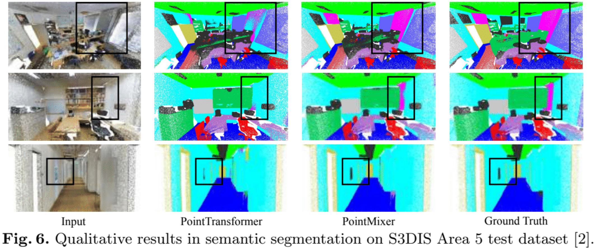

# 3D Semantic Segmentation 
 <br/>
This sub-repository includes the implementation of the three baselines with the S3DIS and ScanNet datasets.
- PointMixer, ECCV 2022 (ours)
- PointTransformer, ICCV 2021 
- PointNet++, Neurips 2017

## Implementation
### Docker (cuda 11.1)
```
# Pull docker image
docker pull jaesungchoe/pointmixer:cuda11.1

# create your own container and attach to the container
docker run -it --gpus '"device=0"' --name pointmixer --shm-size 16G \
  --net=host -e NVIDIA_VISIBLE_DEVICES=0 jaesungchoe/pointmixer:cuda11.1
docker start pointmixer
docker attach pointmixer

# dataset prepration 

# Train / Test
cd /code/ECCV22-PointMixer/sem_seg
sh script/run_s3dis.sh 
sh script/run_scannet.sh 
```
### Conda
```
# load conda env
cd ./conda
conda env create -f environment.yml

# dataset prepration 

# Train / Test
git clone https://github.com/LifeBeyondExpectations/ECCV22-PointMixer
cd ./ECCV22-PointMixer/sem_seg
sh script/run_s3dis.sh 
sh script/run_scannet.sh 
```

## Quantitative results
### S3DIS Area5 test
| Model                             | Params | mAcc (%) | mIoU (%) | Reference |
|:----------------------------------|--------------------:|:--------:|:--------:|:---------:|
| MinkowskiNet42 | 37.9M  | 74.1 | 67.2 | [Checkpoint](https://postechackr-my.sharepoint.com/:u:/g/personal/p0125ch_postech_ac_kr/EZcO0DH6QeNGgIwGFZsmL-4BAlikmHAHlBs4JBcS5XfpVQ?download=1) |
| PointTransformer                  | 7.8M   | 76.5 | 70.4 | [Codes from the authors](https://github.com/POSTECH-CVLab/point-transformer) |
| PointMixer (ours)                 | 6.5M   | 77.4 | 71.4 | TBU |

### ScanNet V2 validation
| Model                             | Voxel Size  | mAcc (%) | mIoU (%) | Reference |
|:----------------------------------|:-----------:|:--------:|:--------:|:---------:|
| MinkowskiNet42    | 2cm | 80.4 | 72.2 | [Official GitHub](https://github.com/chrischoy/SpatioTemporalSegmentation) |
| PointTransformer  | 2cm | - | - | - |
| PointMixer (ours) | 2cm | - | - | - |


## Dataset preparation
### S3DIS (TBU)
### ScanNet (TBU)

